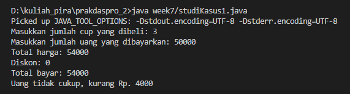
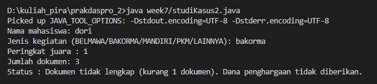
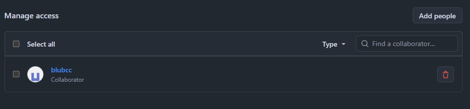
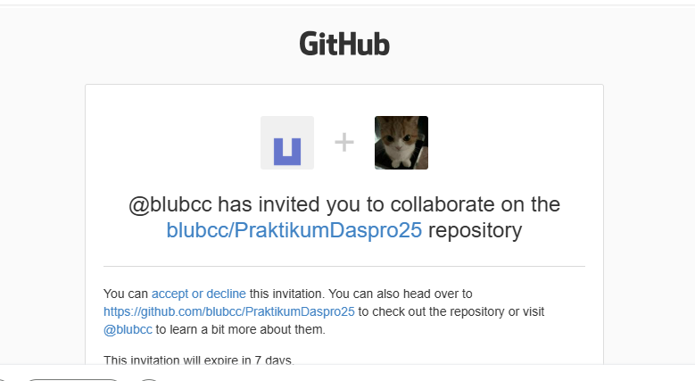
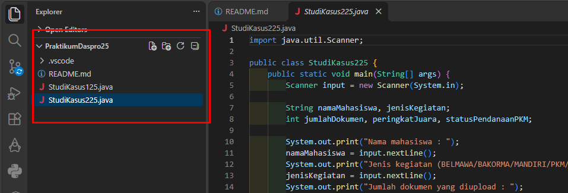
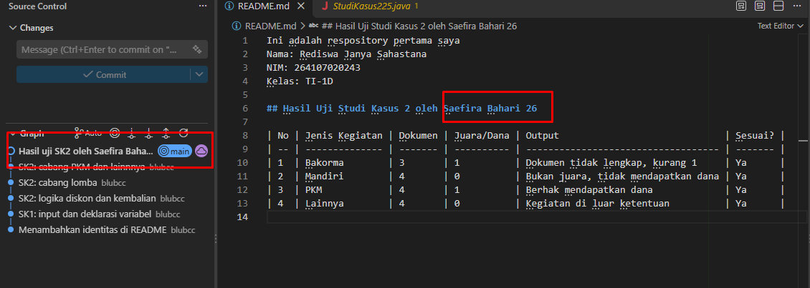
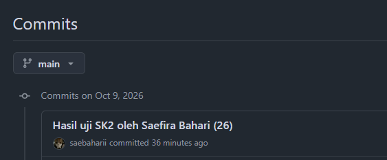
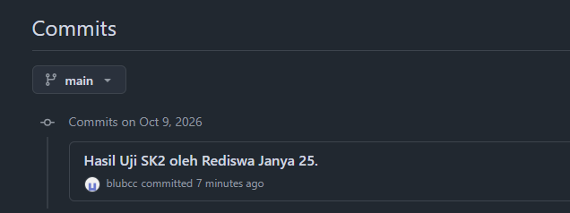
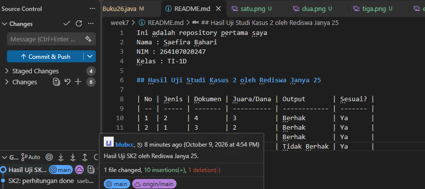

# JOBSHEET 6 - STUDI KASUS PEMILIHAN DENGAN GIT DAN GITHUB

**Identitas Mahasiswa:**
* **Nama:** Saefira Bahari
* **NIM:** 264107020247
* **Kelas / No. Presensi:** TI-1D/26

---

## 1: TUJUAN PRAKTIKUM

1. Mahasiswa mampu menyelesaikan studi kasus menggunakan struktur pemilihan dasar dan pemilihan bersarang.
2. Mahasiswa mampu menyimpan dan mengumpulkan pekerjaan menggunakan Git dan GitHub melalui Visual Studio Code.
3. Mahasiswa mampu berkolaborasi dengan teman menggunakan GitHub.

---

## 2: HASIL PERCOBAAN & ANALISIS

### 2.1 Percobaan 1: Menyiapkan Repository

Repository GitHub disiapkan dan di-clone melalui Visual Studio Code. File `README.md` dibuat untuk mencatat identitas, kemudian di-stage, di-commit, dan di-push ke GitHub. Repository yang digunakan untuk praktikum ini adalah [PraktikumDaspro26](https://github.com/saebaharii/prakdaspro26).

### 2.2 Percobaan 2: Studi Kasus 1 - Pemilihan Dasar

Kedai Kopi Senja menjual Kopi Susu Gula Aren seharga Rp18.000 per cup. Program menghitung total harga, diskon 10% untuk pembelian minimal Rp100.000, total pembayaran, dan kembalian atau kekurangan uang.

#### 2.2.1 Kode Program Java

```java
package week7;
import java.util.Scanner;

public class studiKasus1 {
    public static void main(String[] args) {
        Scanner sc = new Scanner(System.in);
        int hargaPerCup = 18000;
        int jumlahCup, uangBayar, totalHarga, diskon, totalBayar, kembalian, kurang;
        diskon = 0;

        System.out.print("Masukkan jumlah cup yang dibeli: ");
        jumlahCup = sc.nextInt();
        System.out.print("Masukkan jumlah uang yang dibayarkan: ");
        uangBayar = sc.nextInt();
        totalHarga = hargaPerCup * jumlahCup;

        if (totalHarga > 100000) {
            diskon = totalHarga * 10 / 100;
        } else {
            totalBayar = totalHarga - diskon;
            System.out.println("Total harga: " + totalHarga);
            System.out.println("Diskon: " + diskon);
            System.out.println("Total bayar: " + totalBayar);
                if (uangBayar >= totalBayar) {
                kembalian = uangBayar - totalBayar;
                System.out.println("Kembalian: " + kembalian);
                } else {
                    kurang = totalBayar - uangBayar;
                    System.out.println("Uang tidak cukup, kurang Rp. " + kurang);
            }
        }
    }
}
```

#### 2.2.2 Hasil Running



| No. | Jumlah cup | Uang dibayarkan | Total harga | Hasil yang tampil |
| :---: | :---: | :---: | :---: | :--- |
| 1 | 3 | Rp50.000 | Rp54.000 | Diskon Rp0; total bayar Rp54.000; uang kurang Rp4.000 |

#### 2.2.3 Analisis

Untuk input pada gambar, total harga Rp54.000 berada di bawah batas diskon sehingga program menampilkan total harga dan kekurangan pembayaran. Namun, pada kode saat ini, perhitungan dan tampilan total pembayaran hanya berada di cabang `else` dari kondisi `totalHarga > 100000`. Akibatnya, jika total harga lebih dari Rp100.000, program hanya menghitung diskon dan tidak menampilkan total pembayaran atau kembalian. Selain itu, ketentuan jobsheet menyebut diskon berlaku mulai dari Rp100.000, sedangkan kondisi kode menggunakan `>` sehingga pembelian tepat Rp100.000 tidak mendapat diskon. Perbedaan ini perlu diperhatikan saat mengevaluasi hasil program.

### 2.3 Percobaan 3: Studi Kasus 2 - Pemilihan Bersarang

Program membantu Admin Kemahasiswaan mengecek kelayakan dana penghargaan berdasarkan jenis kegiatan, peringkat atau status pendanaan, dan kelengkapan empat dokumen. Jenis kegiatan lomba BELMAWA, BAKORMA, atau Mandiri berhak diproses untuk juara 1 sampai 3; PKM berhak jika lolos pendanaan; kegiatan lainnya tidak memenuhi ketentuan.

#### 2.3.1 Kode Program Java

```java
package week7;

import java.util.Scanner;

public class studikasus2 {
    public static void main(String[] args) {
        Scanner sc = new Scanner(System.in);
        String namaMahasiswa, jenisKegiatan;
        int lolosPendanaan;
        int jumlahDokumen;
        int jumlahDokumenKurang = 0;

        System.out.print("Nama mahasiswa: ");
        namaMahasiswa = sc.nextLine();
        System.out.print("Jenis kegiatan (BELMAWA/BAKORMA/MANDIRI/PKM/LAINNYA): ");
        jenisKegiatan = sc.nextLine();
        if (jenisKegiatan.equalsIgnoreCase("BELMAWA") || jenisKegiatan.equalsIgnoreCase("BAKORMA") || jenisKegiatan.equalsIgnoreCase("MANDIRI")) {
            System.out.print("Peringkat juara : ");
            int peringkatJuara = sc.nextInt();
            if (peringkatJuara > 0 && peringkatJuara <= 3) {
                System.out.print("Jumlah dokumen: ");
                jumlahDokumen = sc.nextInt();
                    if (jumlahDokumen < 4 ){
                        jumlahDokumenKurang = 4 - jumlahDokumen;
                        System.out.println("Status : Dokumen tidak lengkap (kurang " + jumlahDokumenKurang + " dokumen). Dana penghargaan tidak diberikan.");
                    } else {
                        System.out.println("Status : Dokumen lengkap. Dana penghargaan diberikan.");
                    }
            } else{
                System.out.println("Status : Tidak mendapat juara, dana penghargaan tidak diberikan");
            }
        } else if (jenisKegiatan.equalsIgnoreCase("PKM")) {
            System.out.print("Apakah lolos pendanaan? (1/0): ");
            lolosPendanaan = sc.nextInt(); 
            if (lolosPendanaan == 1) {
                System.out.println("Status : Lolos pendanaan. Dana penghargaan diberikan.");
            } else if (lolosPendanaan == 0) {
                System.out.println("Status : Tidak lolos pendanaan. Dana penghargaan tidak diberikan.");
            } else {
                System.out.println("Status : Input tidak valid. Dana penghargaan tidak diberikan."); 
            }
        } else {
            System.out.println("Status : Jenis kegiatan tidak memenuhi syarat. Dana penghargaan tidak diberikan.");
        }
    }
}
```

#### 2.3.2 Hasil Running



#### 2.3.3 Hasil Uji Studi Kasus 2 oleh Rediswa Janya 25

| No. | Jenis kegiatan | Dokumen | Juara / Dana | Output | Sesuai? |
| :---: | :--- | :---: | :---: | :--- | :---: |
| 1 | BAKORMA | 3 | Juara 1 | Dokumen tidak lengkap (kurang 1 dokumen). Dana penghargaan tidak diberikan. | Ya |
| 2 | Mandiri | 4 | 0 (bukan juara 1/2/3) | Tidak mendapat juara, dana penghargaan tidak diberikan. | Ya |
| 3 | PKM | 4 | 1 (lolos pendanaan) | Lolos pendanaan. Dana penghargaan diberikan. | Ya |
| 4 | Lainnya | 4 | Tidak ditanyakan | Jenis kegiatan tidak memenuhi syarat. Dana penghargaan tidak diberikan. | Ya |

#### 2.3.4 Analisis

Kode menggunakan pemilihan bersarang untuk memeriksa jenis kegiatan, peringkat lomba, jumlah dokumen, atau status pendanaan PKM. Gambar menunjukkan cabang BAKORMA: mahasiswa mendapat juara 1, tetapi baru mengunggah 3 dari 4 dokumen sehingga program melaporkan kekurangan 1 dokumen dan tidak memberikan dana.

Ada perbedaan antara ketentuan jobsheet dan implementasi saat ini pada cabang PKM: program langsung memberikan dana ketika status pendanaan bernilai 1 tanpa meminta atau memeriksa jumlah dokumen. Jobsheet mensyaratkan empat dokumen lengkap untuk kegiatan yang memenuhi kriteria, termasuk PKM. Oleh karena itu, hasil uji PKM di atas hanya mencatat keluaran kode yang sekarang dan belum menguji syarat kelengkapan dokumen untuk cabang tersebut.

### 2.4 Percobaan 4: Uji Silang Program Teman

Pengujian silang dilakukan dengan mengundang teman sebagai kolaborator repository. Teman menjalankan program Studi Kasus 2 menggunakan beberapa variasi data, mencatat hasil uji di `README.md`, lalu melakukan commit dan push. Pemilik repository mengambil perubahan tersebut menggunakan Pull atau Sync dan memeriksa hasil serta riwayat commit di GitHub.

#### 2.4.1 Mengundang Kolaborator







#### 2.4.2 Commit dan Push Hasil





#### 2.4.3 Pull Hasil Push Teman





---

## 3: KESIMPULAN

Praktikum ini menerapkan pemilihan dasar untuk menghitung pembayaran dan pemilihan bersarang untuk menentukan kelayakan dana penghargaan. Git dan GitHub melalui Visual Studio Code digunakan untuk menyimpan versi pekerjaan, mengirim perubahan, dan berkolaborasi dalam pengujian silang. Hasil percobaan juga menunjukkan pentingnya membandingkan implementasi dengan ketentuan: pada Studi Kasus 1, kondisi batas dan alur total pembayaran perlu diperhatikan, sedangkan pada Studi Kasus 2, pemeriksaan dokumen belum diterapkan pada jalur PKM.
